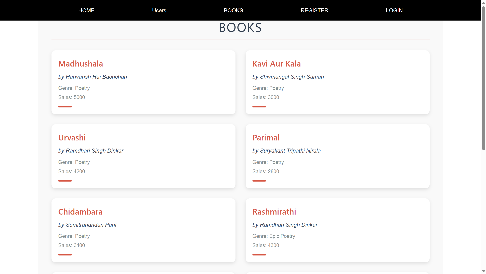
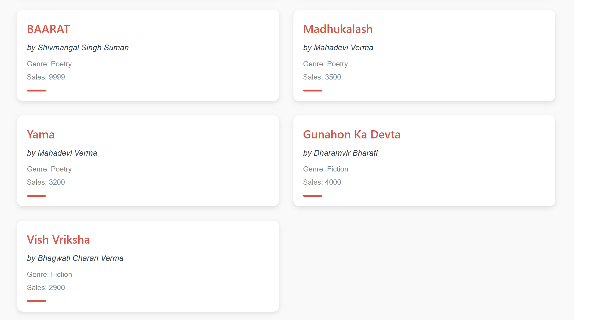
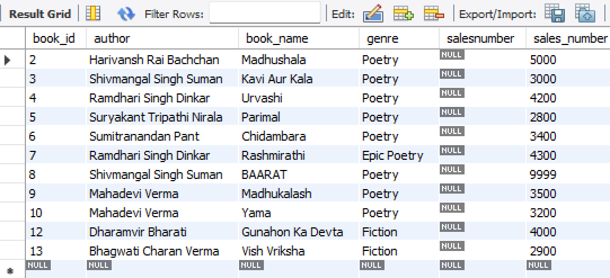

Hello
I am Piyush -B1
I have created this project,i have done maily tasks
Like register user,get user,login user,books page
I have described all things in my project

Here i will be describing my Book Page here
i made a Spring boot rest api crud project Book service
which i previously designed as a task

so to show here the concept that without authication we can add some pages
here i have shown this book pages

LOGIN,REGISTER,USERS
THESE 3 PAGES Require data/authtication/registration
Home page does not connect with any backedn

But my Books Page connects well with the Backend using Book Service and fetches data without any authetication
you will see the Data from Backend here
so it shows in forms of Cards

Thankyou!